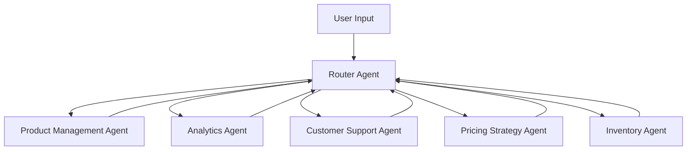

# Marketplace Seller Agent Workflows & Multi-Agent Architecture

## Overview: From Single Chatbot to Multi-Agent System

Instead of one massive chatbot trying to handle everything, we can break it down into **specialized agents** that excel at specific tasks:



## 1. Agent Routing & Switching

### Master Router Agent
```typescript
const RouterState = Annotation.Root({
  ...MessagesAnnotation.spec,
  currentAgent: Annotation<string>,
  userIntent: Annotation<string>,
  confidence: Annotation<number>,
  agentHistory: Annotation<string[]>
});

const routerWorkflow = new StateGraph(RouterState)
  .addNode("classify_intent", classifyUserIntent)
  .addNode("route_to_agent", routeToSpecificAgent)
  .addNode("product_agent", createProductAgent())
  .addNode("analytics_agent", createAnalyticsAgent())
  .addNode("support_agent", createSupportAgent())
  
  .addEdge("__start__", "classify_intent")
  
  .addConditionalEdges("classify_intent", (state) => {
    const intent = state.userIntent;
    
    // Route based on intent classification
    if (intent.includes('product') || intent.includes('listing')) return "product_agent";
    if (intent.includes('sales') || intent.includes('revenue')) return "analytics_agent";
    if (intent.includes('help') || intent.includes('support')) return "support_agent";
    
    return "route_to_agent"; // Default routing logic
  })
  
  // Each agent can route back to classifier for complex conversations
  .addEdge("product_agent", "classify_intent")
  .addEdge("analytics_agent", "classify_intent")
  .addEdge("support_agent", "classify_intent");
```

### Intent Classification Examples
```typescript
const classifyUserIntent = async (state) => {
  const lastMessage = state.messages[state.messages.length - 1].content;
  
  const intents = {
    "Create a new product listing for iPhone cases": "product_management",
    "What were my best selling items last month?": "analytics", 
    "How do I handle a return request?": "customer_support",
    "Should I lower my prices to compete?": "pricing_strategy",
    "I'm out of stock, when should I reorder?": "inventory_management"
  };
  
  // Use AI classification or keyword matching
  const classification = await classifyIntent(lastMessage);
  
  return {
    ...state,
    userIntent: classification.intent,
    confidence: classification.confidence
  };
};
```

## 2. Product Management Agent Workflow

### State & Tools
```typescript
const ProductState = Annotation.Root({
  ...MessagesAnnotation.spec,
  draftListing: Annotation<{
    title?: string,
    description?: string,
    images?: string[],
    price?: number,
    category?: string,
    keywords?: string[]
  }>,
  currentStep: Annotation<'collecting' | 'validating' | 'optimizing' | 'publishing'>,
  validationErrors: Annotation<string[]>
});

// Available Tools
const productTools = [
  wildberriesCreateListing,
  wildberriesUpdateListing, 
  amazonListingTool,
  imageAnalysisTool,
  keywordResearchTool,
  competitorAnalysisTool,
  priceOptimizationTool
];
```

### Workflow
```typescript
const productWorkflow = new StateGraph(ProductState)
  .addNode("collect_info", collectProductInformation)
  .addNode("validate_data", validateProductData)
  .addNode("optimize_listing", optimizeWithAI)
  .addNode("preview_listing", generatePreview)
  .addNode("publish_listing", publishToMarketplace)
  .addNode("monitor_performance", trackListingMetrics)

  .addEdge("__start__", "collect_info")
  
  .addConditionalEdges("collect_info", (state) => {
    if (state.draftListing.title && state.draftListing.description) {
      return "validate_data";
    }
    return "collect_info"; // Keep collecting
  })
  
  .addConditionalEdges("validate_data", (state) => {
    if (state.validationErrors.length > 0) return "collect_info";
    return "optimize_listing";
  })
  
  .addEdge("optimize_listing", "preview_listing")
  .addEdge("preview_listing", "publish_listing")
  .addEdge("publish_listing", "monitor_performance")
  .addEdge("monitor_performance", END);
```

### Example Conversation Flow
```
User: "I want to list a new product"
→ Product Agent: "Great! What product are you selling?"

User: "iPhone 15 cases, silicone material"
→ Product Agent: *collects info* "I'll help optimize this listing..."

User: "Actually, let me check my sales data first"
→ Router: *detects intent change* → Analytics Agent

User: "Now back to creating that listing"
→ Router: *routes back* → Product Agent (maintains draft state)
```

## 3. Analytics Agent Workflow

### State & Tools
```typescript
const AnalyticsState = Annotation.Root({
  ...MessagesAnnotation.spec,
  timeframe: Annotation<'week' | 'month' | 'quarter' | 'year'>,
  metrics: Annotation<{
    revenue?: number,
    units_sold?: number,
    top_products?: any[],
    trends?: any[]
  }>,
  filters: Annotation<{
    category?: string,
    marketplace?: string,
    min_price?: number
  }>
});

const analyticsTools = [
  salesDataRetrieval,
  revenueCalculator,
  trendAnalysis,
  competitorBenchmarking,
  profitMarginAnalysis,
  seasonalityAnalysis
];
```

### Workflow
```typescript
const analyticsWorkflow = new StateGraph(AnalyticsState)
  .addNode("understand_query", parseAnalyticsRequest)
  .addNode("fetch_data", retrieveSalesData)
  .addNode("analyze_data", performAnalysis)
  .addNode("generate_insights", createInsights)
  .addNode("create_visualization", generateCharts)
  .addNode("recommend_actions", suggestOptimizations)

  .addEdge("__start__", "understand_query")
  .addEdge("understand_query", "fetch_data")
  .addEdge("fetch_data", "analyze_data")
  
  .addConditionalEdges("analyze_data", (state) => {
    const dataSize = state.metrics?.top_products?.length || 0;
    if (dataSize > 100) return "create_visualization"; // Large dataset needs viz
    return "generate_insights";
  })
  
  .addEdge("generate_insights", "recommend_actions")
  .addEdge("create_visualization", "recommend_actions")
  .addEdge("recommend_actions", END);
```

## 4. Pricing Strategy Agent

### State & Tools
```typescript
const PricingState = Annotation.Root({
  ...MessagesAnnotation.spec,
  targetProduct: Annotation<any>,
  competitorPrices: Annotation<number[]>,
  costStructure: Annotation<{
    cogs?: number,
    shipping?: number,
    fees?: number,
    target_margin?: number
  }>,
  pricingStrategy: Annotation<'competitive' | 'premium' | 'value' | 'dynamic'>
});

const pricingTools = [
  competitorPriceScrapingTool,
  marginCalculatorTool,
  demandForecastingTool,
  elasticityAnalysisTool,
  seasonalPricingTool
];
```

### Workflow
```typescript
const pricingWorkflow = new StateGraph(PricingState)
  .addNode("analyze_product", analyzeTargetProduct)
  .addNode("research_competitors", scrapeCompetitorPrices)
  .addNode("calculate_costs", determineCostStructure)
  .addNode("test_price_points", runPriceTests)
  .addNode("recommend_price", generatePriceRecommendation)
  .addNode("monitor_results", trackPricePerformance)

  .addEdge("__start__", "analyze_product")
  
  .addConditionalEdges("analyze_product", (state) => {
    if (state.targetProduct.has_competitors) return "research_competitors";
    return "calculate_costs";
  })
  
  .addEdge("research_competitors", "calculate_costs")
  .addEdge("calculate_costs", "test_price_points")
  .addEdge("test_price_points", "recommend_price")
  .addEdge("recommend_price", "monitor_results")
  .addEdge("monitor_results", END);
```

## 5. Inventory Management Agent

### State & Tools  
```typescript
const InventoryState = Annotation.Root({
  ...MessagesAnnotation.spec,
  currentStock: Annotation<any[]>,
  reorderPoints: Annotation<{[sku: string]: number}>,
  supplierInfo: Annotation<any[]>,
  forecastData: Annotation<{
    demand_prediction?: number[],
    seasonal_factors?: number[],
    lead_times?: number[]
  }>
});

const inventoryTools = [
  stockLevelChecker,
  demandForecastingTool,
  supplierManagementTool,
  reorderPointCalculator,
  stockoutRiskAnalyzer
];
```

### Workflow
```typescript
const inventoryWorkflow = new StateGraph(InventoryState)
  .addNode("check_stock_levels", assessCurrentInventory)
  .addNode("forecast_demand", predictFutureDemand)
  .addNode("calculate_reorder", determineReorderPoints)
  .addNode("supplier_analysis", evaluateSuppliers)
  .addNode("generate_orders", createPurchaseOrders)
  .addNode("schedule_alerts", setupStockAlerts)

  .addEdge("__start__", "check_stock_levels")
  
  .addConditionalEdges("check_stock_levels", (state) => {
    const lowStockItems = state.currentStock.filter(item => item.quantity < item.reorderPoint);
    if (lowStockItems.length > 0) return "calculate_reorder";
    return "forecast_demand";
  })
  
  .addEdge("forecast_demand", "calculate_reorder")
  .addEdge("calculate_reorder", "supplier_analysis")
  .addEdge("supplier_analysis", "generate_orders")
  .addEdge("generate_orders", "schedule_alerts")
  .addEdge("schedule_alerts", END);
```

## 6. Customer Support Agent

### Specialized for Seller Support
```typescript
const SupportState = Annotation.Root({
  ...MessagesAnnotation.spec,
  issueType: Annotation<'returns' | 'complaints' | 'shipping' | 'technical' | 'policy'>,
  urgency: Annotation<'low' | 'medium' | 'high' | 'critical'>,
  resolution: Annotation<any>,
  escalationNeeded: Annotation<boolean>
});

const supportWorkflow = new StateGraph(SupportState)
  .addNode("classify_issue", categorizeSupport)
  .addNode("search_kb", searchKnowledgeBase)
  .addNode("provide_solution", generateSolution)
  .addNode("escalate_human", escalateToExpert)
  .addNode("follow_up", scheduleFollowUp)

  .addEdge("__start__", "classify_issue")
  .addEdge("classify_issue", "search_kb")
  
  .addConditionalEdges("search_kb", (state) => {
    if (state.urgency === 'critical') return "escalate_human";
    if (state.confidence > 0.8) return "provide_solution";
    return "escalate_human";
  })
  
  .addEdge("provide_solution", "follow_up")
  .addEdge("escalate_human", "follow_up")
  .addEdge("follow_up", END);
```

## 7. Multi-Agent Conversation Examples

### Example 1: Complex Product Launch
```
User: "I want to launch a new product line"

Router → Product Agent:
"I'll help you create listings. What's the product?"

User: "Smart watches. But first, what price should I set?"

Router → Pricing Agent:
"Let me analyze the smartwatch market..."
*runs competitor analysis*
"Based on features, I recommend $299-349"

User: "Perfect. Now create the listing with that price"

Router → Product Agent:
*retrieves pricing data from previous agent*
"I'll create a listing for $324 based on the pricing analysis..."

User: "How much inventory should I order?"

Router → Inventory Agent:
*accesses product data and pricing*
"Based on similar product performance, I recommend starting with 100 units..."
```

### Example 2: Performance Review
```
User: "My sales are down this month"

Router → Analytics Agent:
*analyzes sales data*
"Revenue dropped 15%. Main issues: electronics category down 30%"

User: "Should I lower my electronics prices?"

Router → Pricing Agent:
*gets context from analytics*
"I see electronics are underperforming. Let me check competitor prices..."
"Competitors lowered prices 8%. I recommend reducing by 5-10%"

User: "Update my iPhone case prices to $24.99"

Router → Product Agent:
*updates listings with new pricing strategy*
"Updated 12 iPhone case listings to $24.99"
```

## 8. Implementation Hints

### Agent Factory Pattern
```typescript
class AgentFactory {
  static createProductAgent(userId: string) {
    return new StateGraph(ProductState)
      .addNode(/* product workflow */)
      .compile({ checkpointer: redisCheckpointer });
  }
  
  static createAnalyticsAgent(userId: string) {
    return new StateGraph(AnalyticsState)
      .addNode(/* analytics workflow */)
      .compile({ checkpointer: redisCheckpointer });
  }
}

// Usage
const router = new MasterRouter({
  agents: {
    product: AgentFactory.createProductAgent(userId),
    analytics: AgentFactory.createAnalyticsAgent(userId),
    pricing: AgentFactory.createPricingAgent(userId)
  }
});
```

### State Sharing Between Agents
```typescript
// Shared context in Redis
const sharedContext = {
  userId,
  currentSession: sessionId,
  agentHistory: ['router', 'product', 'pricing'],
  sharedData: {
    productDraft: { /* data from product agent */ },
    pricingAnalysis: { /* data from pricing agent */ },
    inventoryLevels: { /* data from inventory agent */ }
  }
};
```

### Tool Access Control
```typescript
const getToolsForAgent = (agentType: string, userId: string) => {
  const toolMap = {
    product: [wildberriesTools, imageTools, keywordTools],
    analytics: [salesDataTools, analyticsTools],
    pricing: [competitorTools, calculatorTools],
    inventory: [stockTools, supplierTools]
  };
  
  return toolMap[agentType] || [];
};
```

## 9. Benefits of Multi-Agent Architecture

### Advantages
- **🎯 Specialized Expertise**: Each agent excels at specific tasks
- **🔄 Context Switching**: Seamless transitions between different workflows  
- **🧠 Focused AI**: Smaller, more targeted prompts and tools
- **🔧 Maintainable**: Easy to update individual agent workflows
- **📊 Better Performance**: Specialized tools and optimized flows
- **💰 Cost Efficient**: Only load relevant tools and context

### Agent Coordination Patterns
- **Sequential**: One agent completes, passes to next
- **Collaborative**: Multiple agents work on same problem
- **Hierarchical**: Master agent delegates to sub-agents
- **Event-driven**: Agents respond to specific triggers

This architecture transforms a complex marketplace chatbot into a coordinated team of specialized AI agents, each expert in their domain while maintaining seamless user experience! 