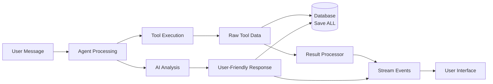

# Multi-Agent Message Flow & Data Strategy

## Overview: Save Everything, Stream Smart

In a multi-agent streaming architecture, we need to balance **complete data persistence** with **optimal user experience**. Here's the strategy for handling messages, tool results, and data flow.



## 1. Message Types & Persistence Strategy

### Messages Saved to Database (Complete History)

```typescript
interface DatabaseMessage {
  id: string;
  conversation_id: string;
  agent_id: string | null;
  role: 'user' | 'assistant' | 'tool' | 'system';
  content: string;
  tool_calls?: ToolCall[];
  tool_call_id?: string;
  tool_name?: string;
  metadata?: any;
  created_at: Date;
}

// Example saved messages
const savedMessages = [
  // 1. User input
  {
    role: 'user',
    content: 'Show me my best selling products',
    agent_id: null
  },
  
  // 2. Agent response with tool call
  {
    role: 'assistant',
    content: "I'll analyze your product performance data...",
    agent_id: 'analytics_agent',
    tool_calls: [{
      id: 'call_123',
      name: 'wildberries_get_products',
      args: { user_id: 'user123', sort_by: 'sales' }
    }]
  },
  
  // 3. Raw tool result (EVERYTHING saved)
  {
    role: 'tool',
    content: JSON.stringify({
      success: true,
      data: {
        products: [
          {
            id: 12345,
            name: "iPhone 15 Pro Case - Premium Leather",
            price: 2499,
            stock: 45,
            sales_30d: 127,
            revenue_30d: 317373,
            category: "Electronics > Phone Accessories",
            images: ["https://...", "https://..."],
            description: "Premium leather case with magnetic closure...",
            keywords: ["iphone", "case", "leather", "premium"],
            competitor_count: 23,
            avg_competitor_price: 2799,
            profit_margin: 0.45,
            review_score: 4.8,
            review_count: 89,
            last_sale: "2024-01-01T08:30:00Z"
            // ... hundreds more fields
          }
          // ... 999 more products with full details
        ],
        metadata: {
          total_count: 1247,
          fetched_at: "2024-01-01T10:30:00Z",
          api_response_time: 850,
          cache_status: "miss",
          api_cost: 0.05
        }
      }
    }),
    tool_call_id: 'call_123',
    tool_name: 'wildberries_get_products',
    agent_id: 'analytics_agent'
  },
  
  // 4. Final agent response after processing
  {
    role: 'assistant',
    content: `Based on your 1,247 products, here are your top performers:

1. **iPhone 15 Pro Case** - 127 sales ($31,737 revenue)
2. **Samsung Galaxy Protector** - 98 sales ($24,500 revenue)
3. **Wireless Charging Pad** - 76 sales ($18,240 revenue)

Your Electronics category is outperforming Fashion by 34%. iPhone accessories specifically show strong demand with 4.8★ average rating.`,
    agent_id: 'analytics_agent'
  }
];
```

### Streaming Events (User Experience)

```typescript
type StreamEvent = 
  | { type: 'agent_start'; agentId: string; agentName: string }
  | { type: 'agent_switch'; fromAgent: string; toAgent: string; reason: string }
  | { type: 'content_chunk'; content: string; agentId: string }
  | { type: 'tool_execution'; toolName: string; description: string; agentId: string }
  | { type: 'tool_progress'; message: string; progress?: number }
  | { type: 'tool_complete'; summary: ToolSummary; agentId: string }
  | { type: 'error'; error: string; agentId: string };

// Example streaming flow
const streamingEvents = [
  // Agent notification
  {
    type: 'agent_start',
    agentId: 'analytics_agent',
    agentName: 'Analytics Specialist'
  },
  
  // Readable content chunks
  {
    type: 'content_chunk',
    content: "I'll analyze your product performance data to identify your best sellers...",
    agentId: 'analytics_agent'
  },
  
  // Tool execution (user-friendly name)
  {
    type: 'tool_execution',
    toolName: 'Product Performance Analysis',
    description: 'Fetching sales data from Wildberries...',
    agentId: 'analytics_agent'
  },
  
  // Optional progress updates for long operations
  {
    type: 'tool_progress',
    message: 'Retrieved 1,247 products, analyzing performance metrics...',
    progress: 60
  },
  
  // Tool completion with structured summary (NOT raw data)
  {
    type: 'tool_complete',
    summary: {
      total_products: 1247,
      categories_analyzed: 5,
      time_period: '30 days',
      top_performer: {
        name: 'iPhone 15 Pro Case',
        sales: 127,
        revenue: 31737
      },
      insights: [
        'Electronics category +34% vs Fashion',
        'iPhone accessories trending up',
        'Average rating 4.8/5 across top products'
      ]
    },
    agentId: 'analytics_agent'
  },
  
  // Final insights (chunked for streaming)
  {
    type: 'content_chunk',
    content: 'Based on your 1,247 products, here are your top performers:\n\n1. **iPhone 15 Pro Case** - 127 sales',
    agentId: 'analytics_agent'
  },
  
  {
    type: 'content_chunk', 
    content: ' ($31,737 revenue)\n2. **Samsung Galaxy Protector** - 98 sales ($24,500 revenue)',
    agentId: 'analytics_agent'
  }
  // ... more chunks
];
```

## 2. Tool Data Processing Strategy

### Raw Data Storage (Database)
```typescript
class ToolResultPersistence {
  async saveRawToolResult(
    conversationId: string,
    toolCall: ToolCall,
    rawResult: any
  ): Promise<void> {
    // Save EVERYTHING - complete API response
    await this.db.messages.insert({
      conversation_id: conversationId,
      role: 'tool',
      content: JSON.stringify(rawResult), // Complete raw data
      tool_call_id: toolCall.id,
      tool_name: toolCall.name,
      metadata: {
        execution_time: rawResult.metadata?.execution_time,
        api_cost: rawResult.metadata?.api_cost,
        cache_hit: rawResult.metadata?.cache_hit
      }
    });
    
    // Also save structured data for easy querying
    if (toolCall.name === 'wildberries_get_products') {
      await this.saveProductSnapshot(conversationId, rawResult.data.products);
    }
  }
  
  private async saveProductSnapshot(
    conversationId: string, 
    products: any[]
  ): Promise<void> {
    // Save structured product data for analytics
    await this.db.agent_conversation_data.upsert({
      conversation_id: conversationId,
      agent_id: 'analytics_agent',
      data_type: 'product_snapshot',
      data: {
        products: products,
        snapshot_date: new Date(),
        total_count: products.length
      },
      expires_at: new Date(Date.now() + 7 * 24 * 60 * 60 * 1000) // 7 days
    });
  }
}
```

### Streaming Data Processing
```typescript
class ToolResultProcessor {
  static async processForStreaming(
    toolName: string, 
    rawResult: any,
    agentId: string
  ): Promise<StreamEvent[]> {
    switch (toolName) {
      case 'wildberries_get_products':
        return this.processProductAnalysis(rawResult, agentId);
      case 'competitor_price_analysis':
        return this.processCompetitorAnalysis(rawResult, agentId);
      case 'inventory_check':
        return this.processInventoryData(rawResult, agentId);
      default:
        return this.processGenericTool(rawResult, agentId);
    }
  }
  
  private static processProductAnalysis(
    result: any, 
    agentId: string
  ): StreamEvent[] {
    const products = result.data.products;
    const events: StreamEvent[] = [];
    
    // Tool completion with useful summary
    events.push({
      type: 'tool_complete',
      summary: {
        total_products: products.length,
        categories: new Set(products.map(p => p.category)).size,
        total_revenue_30d: products.reduce((sum, p) => sum + (p.revenue_30d || 0), 0),
        avg_rating: products.reduce((sum, p) => sum + (p.review_score || 0), 0) / products.length,
        top_product: products.sort((a, b) => (b.sales_30d || 0) - (a.sales_30d || 0))[0],
        trends: this.calculateTrends(products),
        performance_insights: this.generateInsights(products)
      },
      agentId
    });
    
    return events;
  }
  
  private static generateInsights(products: any[]): string[] {
    const insights = [];
    
    // Category performance
    const categoryStats = this.groupByCategory(products);
    const topCategory = Object.entries(categoryStats)
      .sort(([,a], [,b]) => b.revenue - a.revenue)[0];
    
    if (topCategory) {
      insights.push(`${topCategory[0]} is your top category with $${topCategory[1].revenue.toLocaleString()} revenue`);
    }
    
    // Rating insights
    const highRatedProducts = products.filter(p => p.review_score >= 4.5);
    if (highRatedProducts.length > products.length * 0.6) {
      insights.push('Strong customer satisfaction - 60%+ products rated 4.5+ stars');
    }
    
    // Inventory warnings
    const lowStock = products.filter(p => p.stock < 10);
    if (lowStock.length > 0) {
      insights.push(`${lowStock.length} products running low on inventory`);
    }
    
    return insights;
  }
}
```

## 3. Frontend Integration

### Event Handler Implementation
```typescript
class MultiAgentChatUI {
  private messageContainer: HTMLElement;
  private currentMessage: HTMLElement | null = null;
  private toolIndicators: Map<string, HTMLElement> = new Map();
  
  handleStreamEvent(event: StreamEvent): void {
    switch (event.type) {
      case 'agent_start':
        this.showAgentIndicator(event.agentId, event.agentName);
        this.startNewMessage(event.agentName);
        break;
        
      case 'agent_switch':
        this.showAgentTransition(event.fromAgent, event.toAgent, event.reason);
        this.startNewMessage(event.toAgent);
        break;
        
      case 'content_chunk':
        this.appendToCurrentMessage(event.content);
        break;
        
      case 'tool_execution':
        this.showToolProgress(event.toolName, event.description, 'running');
        break;
        
      case 'tool_complete':
        this.showToolProgress(event.toolName, 'Complete', 'success');
        this.renderToolSummary(event.summary);
        break;
        
      case 'error':
        this.showError(event.error, event.agentId);
        break;
    }
  }
  
  private renderToolSummary(summary: ToolSummary): void {
    // Create rich, structured display - NOT raw JSON
    const summaryEl = document.createElement('div');
    summaryEl.className = 'tool-summary';
    
    if (summary.total_products) {
      summaryEl.innerHTML = `
        <div class="summary-card">
          <h4>📊 Analysis Complete</h4>
          <div class="summary-grid">
            <div class="stat">
              <span class="number">${summary.total_products}</span>
              <span class="label">Products Analyzed</span>
            </div>
            <div class="stat">
              <span class="number">$${summary.total_revenue_30d?.toLocaleString()}</span>
              <span class="label">30-Day Revenue</span>
            </div>
            <div class="stat">
              <span class="number">${summary.avg_rating?.toFixed(1)}⭐</span>
              <span class="label">Avg Rating</span>
            </div>
          </div>
          
          <div class="top-product">
            <strong>🏆 Top Performer:</strong> ${summary.top_product?.name}
            <br><small>${summary.top_product?.sales_30d} sales • $${summary.top_product?.revenue_30d?.toLocaleString()}</small>
          </div>
          
          ${summary.performance_insights ? `
            <div class="insights">
              <strong>💡 Key Insights:</strong>
              <ul>
                ${summary.performance_insights.map(insight => `<li>${insight}</li>`).join('')}
              </ul>
            </div>
          ` : ''}
        </div>
      `;
    }
    
    this.messageContainer.appendChild(summaryEl);
  }
  
  private showToolProgress(toolName: string, message: string, status: 'running' | 'success' | 'error'): void {
    let indicator = this.toolIndicators.get(toolName);
    
    if (!indicator) {
      indicator = document.createElement('div');
      indicator.className = 'tool-indicator';
      this.messageContainer.appendChild(indicator);
      this.toolIndicators.set(toolName, indicator);
    }
    
    const statusIcon = {
      running: '⏳',
      success: '✅', 
      error: '❌'
    }[status];
    
    indicator.innerHTML = `
      <div class="tool-status ${status}">
        ${statusIcon} <strong>${toolName}</strong>
        <span class="tool-message">${message}</span>
      </div>
    `;
    
    if (status !== 'running') {
      // Remove indicator after completion
      setTimeout(() => {
        indicator?.remove();
        this.toolIndicators.delete(toolName);
      }, 3000);
    }
  }
}
```

### CSS for Rich Tool Display
```css
.tool-summary {
  margin: 1rem 0;
  padding: 0;
}

.summary-card {
  background: linear-gradient(135deg, #f8fafc 0%, #e2e8f0 100%);
  border: 1px solid #cbd5e1;
  border-radius: 12px;
  padding: 1.5rem;
  margin: 1rem 0;
}

.summary-grid {
  display: grid;
  grid-template-columns: repeat(auto-fit, minmax(120px, 1fr));
  gap: 1rem;
  margin: 1rem 0;
}

.stat {
  text-align: center;
  padding: 0.75rem;
  background: white;
  border-radius: 8px;
  box-shadow: 0 1px 3px rgba(0,0,0,0.1);
}

.stat .number {
  display: block;
  font-size: 1.5rem;
  font-weight: bold;
  color: #1e40af;
}

.stat .label {
  display: block;
  font-size: 0.75rem;
  color: #64748b;
  text-transform: uppercase;
  letter-spacing: 0.05em;
}

.top-product {
  background: #fef3c7;
  border: 1px solid #f59e0b;
  border-radius: 8px;
  padding: 1rem;
  margin: 1rem 0;
}

.insights ul {
  margin: 0.5rem 0;
  padding-left: 1.5rem;
}

.insights li {
  margin: 0.25rem 0;
  color: #374151;
}

.tool-indicator {
  margin: 0.5rem 0;
  padding: 0.75rem;
  background: #f1f5f9;
  border-radius: 6px;
  border-left: 3px solid #3b82f6;
}

.tool-status.running {
  animation: pulse 2s infinite;
}

.tool-status.success {
  border-left-color: #10b981;
  background: #ecfdf5;
}

.tool-status.error {
  border-left-color: #ef4444;
  background: #fef2f2;
}
```

## 4. Complete Flow Example

### User Journey: "Show my best products"
```typescript
// 1. User message saved
await saveMessage({
  role: 'user',
  content: 'Show me my best selling products this month',
  agent_id: null
});

// 2. Stream: Agent start
yield { type: 'agent_start', agentId: 'analytics_agent', agentName: 'Analytics' };

// 3. Stream: Initial response
yield { type: 'content_chunk', content: "I'll analyze your sales performance..." };

// 4. Save: Agent message with tool call
await saveMessage({
  role: 'assistant', 
  content: "I'll analyze your sales performance...",
  agent_id: 'analytics_agent',
  tool_calls: [{ name: 'wildberries_get_products', args: {...} }]
});

// 5. Stream: Tool execution
yield { type: 'tool_execution', toolName: 'Product Analysis', description: 'Fetching data...' };

// 6. Execute tool, get raw result
const rawResult = await executeWildberriesAPI();

// 7. Save: Complete raw tool result (1000+ products)
await saveMessage({
  role: 'tool',
  content: JSON.stringify(rawResult), // EVERYTHING
  tool_call_id: 'call_123',
  tool_name: 'wildberries_get_products'
});

// 8. Stream: Tool completion with summary (NOT raw data)
yield { 
  type: 'tool_complete', 
  summary: {
    total_products: 1247,
    top_performer: { name: 'iPhone Case', sales: 127 },
    insights: ['Electronics +34% vs Fashion', 'High customer satisfaction']
  }
};

// 9. AI processes raw data, streams insights
yield { type: 'content_chunk', content: 'Your top performer is iPhone 15 Case with 127 sales...' };

// 10. Save: Final processed response
await saveMessage({
  role: 'assistant',
  content: 'Your top performer is iPhone 15 Case with 127 sales ($31,737 revenue)...',
  agent_id: 'analytics_agent'
});
```

## 5. Benefits Summary

### Database Benefits
- **🔍 Complete Audit Trail**: Every API call and response preserved
- **📊 Rich Analytics**: Can analyze tool usage, costs, performance  
- **🔄 Context Recovery**: Agents can reference full historical data
- **💰 Cost Optimization**: Avoid repeated expensive API calls
- **🐛 Debugging**: Full conversation replay with all data

### Streaming Benefits  
- **⚡ Fast UX**: Immediate feedback, progressive disclosure
- **📱 Mobile Friendly**: Bandwidth efficient, structured events
- **🎨 Rich UI**: Custom rendering for different event types
- **👤 User Focused**: Human-readable summaries, not technical data
- **🔄 Real-time**: Tool progress, agent switches, live updates

### Development Benefits
- **🔧 Separation of Concerns**: Storage vs presentation logic separate
- **🧪 Testable**: Can test data processing and UI rendering independently  
- **📈 Scalable**: Handle large datasets without overwhelming frontend
- **🛠️ Maintainable**: Clear contracts between backend and frontend
- **🔌 Extensible**: Easy to add new tool result processors

This approach ensures users get a smooth, responsive experience while developers maintain complete data fidelity and system observability! 