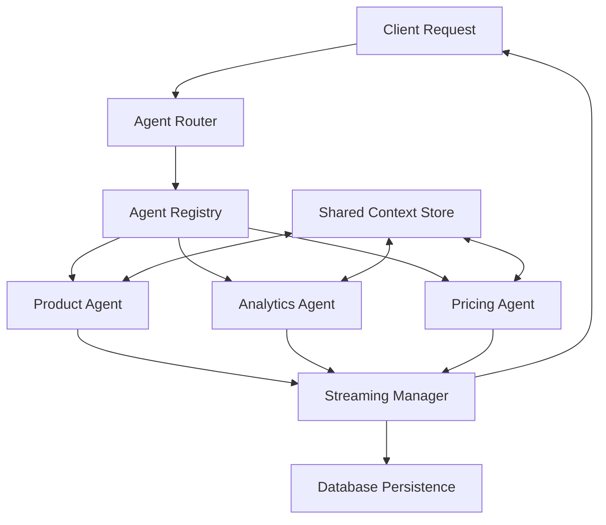

# Multi-Agent Streaming Architecture: Plug & Play Design

## Overview: Modular Agent System with Streaming & Persistence

Building a **plug-and-play multi-agent system** that handles streaming responses and database persistence requires careful architecture. Here's how to design it:



## 1. Plugin Architecture Foundation

### Agent Registry Pattern
```typescript
interface IAgent {
  id: string;
  name: string;
  description: string;
  intents: string[];
  tools: Tool[];
  workflow: CompiledStateGraph;
  initialize(userId: string, config: AgentConfig): Promise<void>;
  canHandle(intent: string, context: ConversationContext): boolean;
  execute(state: AgentState, config: ExecutionConfig): AsyncIterable<AgentEvent>;
}

class AgentRegistry {
  private agents: Map<string, IAgent> = new Map();
  
  registerAgent(agent: IAgent): void {
    this.agents.set(agent.id, agent);
    logger.info(`Registered agent: ${agent.id}`);
  }
  
  getAgent(agentId: string): IAgent | undefined {
    return this.agents.get(agentId);
  }
  
  findAgentForIntent(intent: string, context: ConversationContext): IAgent | null {
    for (const agent of this.agents.values()) {
      if (agent.canHandle(intent, context)) {
        return agent;
      }
    }
    return null;
  }
  
  listAgents(): IAgent[] {
    return Array.from(this.agents.values());
  }
}
```

### Base Agent Class
```typescript
abstract class BaseAgent implements IAgent {
  abstract id: string;
  abstract name: string;
  abstract description: string;
  abstract intents: string[];
  abstract tools: Tool[];
  abstract workflow: CompiledStateGraph;
  
  async initialize(userId: string, config: AgentConfig): Promise<void> {
    // Common initialization logic
  }
  
  canHandle(intent: string, context: ConversationContext): boolean {
    return this.intents.some(pattern => 
      intent.toLowerCase().includes(pattern.toLowerCase())
    );
  }
  
  abstract async *execute(
    state: AgentState, 
    config: ExecutionConfig
  ): AsyncIterable<AgentEvent>;
}
```

## 2. Streaming Event System

### Agent Event Types
```typescript
type AgentEvent = 
  | { type: 'agent_start'; agentId: string; agentName: string }
  | { type: 'agent_switch'; fromAgent: string; toAgent: string; reason: string }
  | { type: 'content_chunk'; content: string; agentId: string }
  | { type: 'tool_execution'; toolName: string; agentId: string }
  | { type: 'tool_result'; result: any; toolName: string; agentId: string }
  | { type: 'agent_complete'; agentId: string; finalState: any }
  | { type: 'error'; error: string; agentId: string }
  | { type: 'conversation_end' };

interface StreamingManager {
  startConversation(conversationId: string): AsyncIterable<AgentEvent>;
  processMessage(message: string, context: ConversationContext): AsyncIterable<AgentEvent>;
  switchAgent(newAgentId: string, reason: string): Promise<void>;
  endConversation(): Promise<void>;
}
```

### Streaming Implementation
```typescript
class MultiAgentStreamingManager implements StreamingManager {
  private currentAgent: IAgent | null = null;
  private registry: AgentRegistry;
  private contextStore: SharedContextStore;
  private dbPersistence: DatabasePersistence;
  
  constructor(
    registry: AgentRegistry,
    contextStore: SharedContextStore,
    dbPersistence: DatabasePersistence
  ) {
    this.registry = registry;
    this.contextStore = contextStore;
    this.dbPersistence = dbPersistence;
  }
  
  async *processMessage(
    message: string, 
    context: ConversationContext
  ): AsyncIterable<AgentEvent> {
    try {
      // Classify intent and determine agent
      const intent = await this.classifyIntent(message, context);
      const targetAgent = this.registry.findAgentForIntent(intent, context);
      
      if (!targetAgent) {
        yield { type: 'error', error: 'No suitable agent found', agentId: 'router' };
        return;
      }
      
      // Switch agent if needed
      if (this.currentAgent?.id !== targetAgent.id) {
        yield* this.handleAgentSwitch(targetAgent, 'intent_change');
      }
      
      // Execute with the selected agent
      yield* this.executeWithAgent(targetAgent, message, context);
      
    } catch (error) {
      yield { 
        type: 'error', 
        error: error.message, 
        agentId: this.currentAgent?.id || 'unknown' 
      };
    }
  }
  
  private async *handleAgentSwitch(
    newAgent: IAgent, 
    reason: string
  ): AsyncIterable<AgentEvent> {
    const previousAgent = this.currentAgent?.id || 'none';
    
    // Notify about agent switch
    yield {
      type: 'agent_switch',
      fromAgent: previousAgent,
      toAgent: newAgent.id,
      reason
    };
    
    // Save current agent state if switching
    if (this.currentAgent) {
      await this.contextStore.saveAgentState(
        this.currentAgent.id, 
        await this.getCurrentAgentState()
      );
    }
    
    // Initialize new agent
    this.currentAgent = newAgent;
    yield {
      type: 'agent_start',
      agentId: newAgent.id,
      agentName: newAgent.name
    };
  }
  
  private async *executeWithAgent(
    agent: IAgent,
    message: string,
    context: ConversationContext
  ): AsyncIterable<AgentEvent> {
    // Get shared context and agent-specific state
    const sharedContext = await this.contextStore.getSharedContext(context.conversationId);
    const agentState = await this.contextStore.getAgentState(agent.id);
    
    // Prepare execution state
    const executionState = {
      messages: [...context.messages, { role: 'user', content: message }],
      sharedContext,
      agentState,
      conversationId: context.conversationId,
      userId: context.userId
    };
    
    // Stream agent execution
    for await (const event of agent.execute(executionState, { stream: true })) {
      // Persist events to database
      await this.dbPersistence.saveEvent(event, context.conversationId);
      
      // Forward to client
      yield event;
    }
  }
}
```

## 3. Shared Context Management

### Context Store Design
```typescript
interface SharedContextStore {
  // Conversation-level data (persists across agents)
  getSharedContext(conversationId: string): Promise<SharedContext>;
  updateSharedContext(conversationId: string, updates: Partial<SharedContext>): Promise<void>;
  
  // Agent-specific state (persists for individual agents)
  getAgentState(agentId: string, conversationId: string): Promise<AgentState>;
  saveAgentState(agentId: string, conversationId: string, state: AgentState): Promise<void>;
  
  // Cross-agent data sharing
  shareData(fromAgent: string, toAgent: string, data: any): Promise<void>;
  getSharedData(agentId: string): Promise<any>;
}

interface SharedContext {
  conversationId: string;
  userId: string;
  sessionData: {
    currentProducts?: any[];
    userPreferences?: object;
    temporaryData?: object;
  };
  agentHistory: {
    agentId: string;
    timestamp: string;
    context: any;
  }[];
}
```

### Redis-Based Implementation
```typescript
class RedisContextStore implements SharedContextStore {
  private redis: Redis;
  
  constructor(redis: Redis) {
    this.redis = redis;
  }
  
  async getSharedContext(conversationId: string): Promise<SharedContext> {
    const key = `context:${conversationId}`;
    const data = await this.redis.get(key);
    return data ? JSON.parse(data) : this.createEmptyContext(conversationId);
  }
  
  async updateSharedContext(
    conversationId: string, 
    updates: Partial<SharedContext>
  ): Promise<void> {
    const current = await this.getSharedContext(conversationId);
    const updated = { ...current, ...updates };
    
    await this.redis.setex(
      `context:${conversationId}`,
      3600 * 24, // 24 hour expiry
      JSON.stringify(updated)
    );
  }
  
  async getAgentState(agentId: string, conversationId: string): Promise<AgentState> {
    const key = `agent:${agentId}:${conversationId}`;
    const data = await this.redis.get(key);
    return data ? JSON.parse(data) : {};
  }
  
  async saveAgentState(
    agentId: string, 
    conversationId: string, 
    state: AgentState
  ): Promise<void> {
    const key = `agent:${agentId}:${conversationId}`;
    await this.redis.setex(key, 3600 * 24, JSON.stringify(state));
  }
  
  async shareData(fromAgent: string, toAgent: string, data: any): Promise<void> {
    const key = `shared:${fromAgent}:${toAgent}`;
    await this.redis.setex(key, 3600, JSON.stringify(data));
  }
}
```

## 4. Database Schema for Multi-Agent Persistence

### Enhanced Message Schema
```sql
-- Messages table with agent tracking
CREATE TABLE messages (
  id UUID PRIMARY KEY DEFAULT gen_random_uuid(),
  conversation_id UUID NOT NULL,
  agent_id VARCHAR(50), -- Which agent generated this message
  role VARCHAR(20) NOT NULL, -- 'user', 'assistant', 'tool', 'system'
  content TEXT NOT NULL,
  tool_calls JSONB,
  tool_call_id VARCHAR(255),
  tool_name VARCHAR(100),
  metadata JSONB, -- Agent-specific metadata
  created_at TIMESTAMP WITH TIME ZONE DEFAULT NOW(),
  updated_at TIMESTAMP WITH TIME ZONE DEFAULT NOW()
);

-- Agent interactions tracking
CREATE TABLE agent_interactions (
  id UUID PRIMARY KEY DEFAULT gen_random_uuid(),
  conversation_id UUID NOT NULL,
  agent_id VARCHAR(50) NOT NULL,
  action_type VARCHAR(30) NOT NULL, -- 'start', 'switch', 'complete', 'error'
  from_agent VARCHAR(50), -- For agent switches
  reason TEXT, -- Why the action occurred
  state_snapshot JSONB, -- Agent state at this point
  created_at TIMESTAMP WITH TIME ZONE DEFAULT NOW()
);

-- Agent-specific conversation data
CREATE TABLE agent_conversation_data (
  id UUID PRIMARY KEY DEFAULT gen_random_uuid(),
  conversation_id UUID NOT NULL,
  agent_id VARCHAR(50) NOT NULL,
  data_type VARCHAR(50) NOT NULL, -- 'draft_listing', 'analysis_result', etc.
  data JSONB NOT NULL,
  expires_at TIMESTAMP WITH TIME ZONE,
  created_at TIMESTAMP WITH TIME ZONE DEFAULT NOW(),
  updated_at TIMESTAMP WITH TIME ZONE DEFAULT NOW(),
  
  UNIQUE(conversation_id, agent_id, data_type)
);
```

### Database Persistence Implementation
```typescript
class DatabasePersistence {
  private supabase: SupabaseClient;
  
  constructor(supabase: SupabaseClient) {
    this.supabase = supabase;
  }
  
  async saveEvent(event: AgentEvent, conversationId: string): Promise<void> {
    switch (event.type) {
      case 'content_chunk':
        // Accumulate chunks and save complete messages
        await this.accumulateMessage(event, conversationId);
        break;
        
      case 'agent_start':
      case 'agent_switch':
      case 'agent_complete':
        await this.saveAgentInteraction(event, conversationId);
        break;
        
      case 'tool_result':
        await this.saveToolResult(event, conversationId);
        break;
    }
  }
  
  private async saveAgentInteraction(
    event: AgentEvent, 
    conversationId: string
  ): Promise<void> {
    const { error } = await this.supabase
      .from('agent_interactions')
      .insert({
        conversation_id: conversationId,
        agent_id: event.agentId,
        action_type: event.type.replace('agent_', ''),
        from_agent: event.type === 'agent_switch' ? event.fromAgent : null,
        reason: event.type === 'agent_switch' ? event.reason : null,
        state_snapshot: event.type === 'agent_complete' ? event.finalState : null
      });
      
    if (error) {
      logger.error('Failed to save agent interaction:', error);
    }
  }
  
  async saveAgentData(
    conversationId: string,
    agentId: string,
    dataType: string,
    data: any,
    expiresAt?: Date
  ): Promise<void> {
    const { error } = await this.supabase
      .from('agent_conversation_data')
      .upsert({
        conversation_id: conversationId,
        agent_id: agentId,
        data_type: dataType,
        data,
        expires_at: expiresAt?.toISOString()
      });
      
    if (error) {
      logger.error('Failed to save agent data:', error);
    }
  }
  
  async getAgentData(
    conversationId: string,
    agentId: string,
    dataType: string
  ): Promise<any> {
    const { data, error } = await this.supabase
      .from('agent_conversation_data')
      .select('data')
      .eq('conversation_id', conversationId)
      .eq('agent_id', agentId)
      .eq('data_type', dataType)
      .single();
      
    return error ? null : data?.data;
  }
}
```

## 5. Concrete Agent Implementation

### Product Management Agent Example
```typescript
class ProductAgent extends BaseAgent {
  id = 'product_agent';
  name = 'Product Management';
  description = 'Handles product listing creation and optimization';
  intents = ['product', 'listing', 'create', 'optimize', 'publish'];
  tools = [wildberriesAPI, imageAnalysis, keywordResearch];
  workflow: CompiledStateGraph;
  
  constructor() {
    super();
    this.workflow = this.createWorkflow();
  }
  
  async *execute(
    state: AgentState, 
    config: ExecutionConfig
  ): AsyncIterable<AgentEvent> {
    yield { type: 'agent_start', agentId: this.id, agentName: this.name };
    
    try {
      // Get existing draft from database if any
      const existingDraft = await this.getExistingDraft(state.conversationId);
      
      const initialState = {
        ...state,
        draftListing: existingDraft || {},
        currentStep: 'collecting'
      };
      
      // Stream workflow execution
      const stream = await this.workflow.stream(initialState, {
        configurable: { thread_id: `${this.id}:${state.conversationId}` }
      });
      
      for await (const chunk of stream) {
        for (const [nodeName, nodeData] of Object.entries(chunk)) {
          if (nodeData.messages) {
            for (const message of nodeData.messages) {
              if (message.content) {
                yield {
                  type: 'content_chunk',
                  content: message.content,
                  agentId: this.id
                };
              }
              
              if (message.tool_calls) {
                for (const toolCall of message.tool_calls) {
                  yield {
                    type: 'tool_execution',
                    toolName: toolCall.name,
                    agentId: this.id
                  };
                }
              }
            }
          }
          
          // Save draft state updates
          if (nodeData.draftListing) {
            await this.saveDraft(state.conversationId, nodeData.draftListing);
          }
        }
      }
      
      yield { type: 'agent_complete', agentId: this.id, finalState: state };
      
    } catch (error) {
      yield { type: 'error', error: error.message, agentId: this.id };
    }
  }
  
  private async getExistingDraft(conversationId: string): Promise<any> {
    // Implementation would fetch from database
    return null;
  }
  
  private async saveDraft(conversationId: string, draft: any): Promise<void> {
    // Implementation would save to database
  }
  
  private createWorkflow(): CompiledStateGraph {
    // Product workflow implementation (from previous examples)
    return new StateGraph(ProductState)
      .addNode("collect_info", this.collectInfo.bind(this))
      .addNode("validate_data", this.validateData.bind(this))
      // ... other nodes
      .compile();
  }
}
```

## 6. Configuration & Plugin System

### Agent Configuration
```typescript
interface AgentConfig {
  // Agent metadata
  id: string;
  name: string;
  description: string;
  version: string;
  
  // Behavior configuration
  intents: string[];
  priority: number; // For conflict resolution
  enabled: boolean;
  
  // Tool configuration
  tools: ToolConfig[];
  
  // Workflow configuration
  workflow: WorkflowConfig;
  
  // Resource limits
  maxExecutionTime?: number;
  maxMemoryUsage?: number;
}

interface ToolConfig {
  name: string;
  enabled: boolean;
  config: any;
}

// Configuration file example
const agentConfigs: AgentConfig[] = [
  {
    id: 'product_agent',
    name: 'Product Management',
    description: 'Handles product operations',
    version: '1.0.0',
    intents: ['product', 'listing', 'create'],
    priority: 1,
    enabled: true,
    tools: [
      { name: 'wildberries_api', enabled: true, config: {} },
      { name: 'image_analysis', enabled: true, config: { max_size: '10MB' } }
    ],
    workflow: { 
      type: 'product_workflow',
      config: { timeout: 300000 }
    }
  }
];
```

### Plugin Loader
```typescript
class AgentPluginLoader {
  private registry: AgentRegistry;
  
  constructor(registry: AgentRegistry) {
    this.registry = registry;
  }
  
  async loadAgents(configs: AgentConfig[]): Promise<void> {
    for (const config of configs) {
      if (!config.enabled) continue;
      
      try {
        const agent = await this.createAgentFromConfig(config);
        this.registry.registerAgent(agent);
        logger.info(`Loaded agent: ${config.id}`);
      } catch (error) {
        logger.error(`Failed to load agent ${config.id}:`, error);
      }
    }
  }
  
  private async createAgentFromConfig(config: AgentConfig): Promise<IAgent> {
    // Dynamic agent creation based on configuration
    const agentClass = await this.getAgentClass(config.id);
    const agent = new agentClass();
    
    // Configure tools
    agent.tools = await this.loadTools(config.tools);
    
    return agent;
  }
}
```

## 7. Client Integration

### Frontend Streaming Handler
```typescript
class MultiAgentStreamingClient {
  private eventSource: EventSource;
  private currentAgent: string | null = null;
  
  async startConversation(conversationId: string): Promise<void> {
    this.eventSource = new EventSource(`/api/stream/${conversationId}`);
    
    this.eventSource.onmessage = (event) => {
      const agentEvent: AgentEvent = JSON.parse(event.data);
      this.handleAgentEvent(agentEvent);
    };
  }
  
  private handleAgentEvent(event: AgentEvent): void {
    switch (event.type) {
      case 'agent_start':
        this.onAgentStart(event.agentId, event.agentName);
        break;
        
      case 'agent_switch':
        this.onAgentSwitch(event.fromAgent, event.toAgent, event.reason);
        break;
        
      case 'content_chunk':
        this.onContentChunk(event.content, event.agentId);
        break;
        
      case 'tool_execution':
        this.onToolExecution(event.toolName, event.agentId);
        break;
        
      case 'error':
        this.onError(event.error, event.agentId);
        break;
    }
  }
  
  private onAgentStart(agentId: string, agentName: string): void {
    this.currentAgent = agentId;
    this.showAgentIndicator(agentName);
  }
  
  private onAgentSwitch(fromAgent: string, toAgent: string, reason: string): void {
    this.showAgentTransition(fromAgent, toAgent, reason);
    this.currentAgent = toAgent;
  }
  
  private onContentChunk(content: string, agentId: string): void {
    this.appendToMessage(content, agentId);
  }
}
```

## 8. Benefits of This Architecture

### Advantages
- **🔌 True Plug & Play**: Add/remove agents without code changes
- **📊 Streaming Aware**: Handles agent switches during streaming
- **💾 Persistent State**: Maintains context across agents and sessions
- **🔄 Seamless UX**: Users don't notice agent transitions
- **🛠️ Developer Friendly**: Easy to test and debug individual agents
- **📈 Scalable**: Each agent can be optimized independently

### Plugin Benefits
- **Independent Development**: Teams can work on different agents
- **Version Management**: Agents can be updated independently
- **Resource Isolation**: Failed agents don't crash the system
- **A/B Testing**: Easy to test different agent versions
- **Custom Deployments**: Different customers can have different agent sets

This architecture provides a robust foundation for building sophisticated multi-agent systems that feel like a single, intelligent assistant to users while being highly modular and maintainable for developers! 